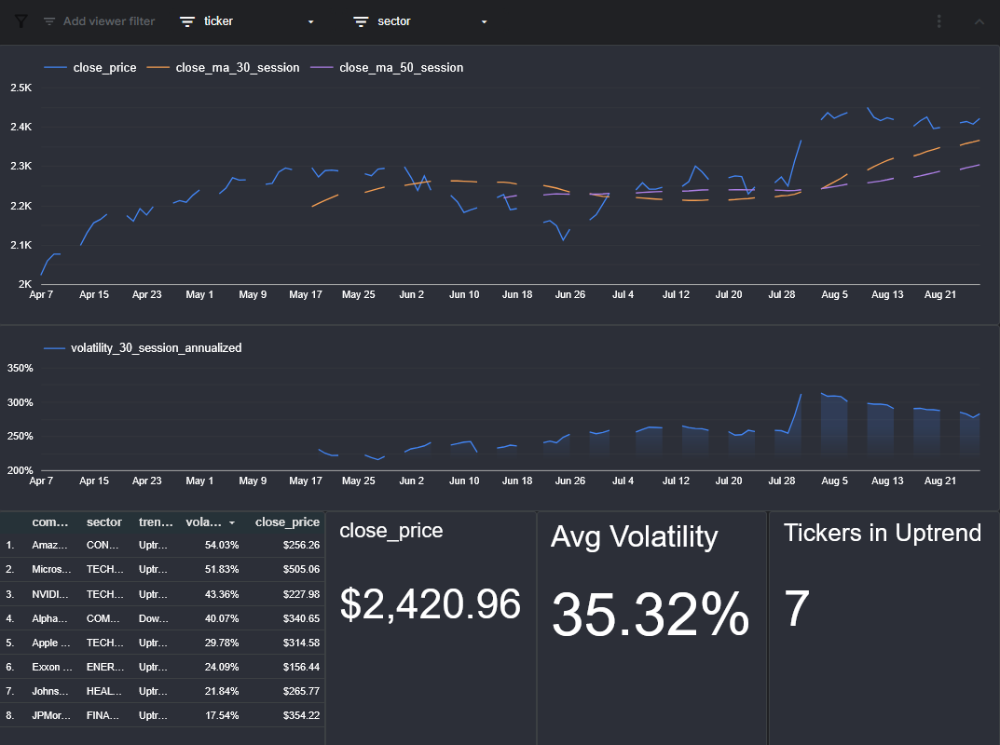
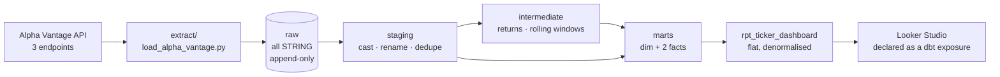

# Stock Ticker Analysis

An end-to-end ELT pipeline that pulls daily equity prices from the Alpha Vantage API into BigQuery, models them with dbt, and publishes a mart of moving averages, annualised volatility and trend signals.

**Stack:** Python · BigQuery · dbt 1.12 · dbt-utils · Looker Studio

---

## What it produces

One row per ticker per trading session

**[View the live dashboard](https://datastudio.google.com/s/s1mqFkaO3Wc)** — price against its 30- and 50-session
moving averages, annualised volatility, and a sector filter.



It fetches prices for eight large-cap stocks, works out how each one is trending and how violently it has been moving, and runs over 100 automated checks before publishing. If the data is wrong, the pipeline stops.

---

## Architecture



| Layer | Materialisation | Models | Job |
|---|---|---|---|
| `raw` | table (loaded by Python) | 3 sources | Land API responses untouched |
| `staging` | view | 2 | Cast, rename, deduplicate. Nothing else. |
| `intermediate` | view | 2 | Returns, moving averages, volatility |
| `marts` | table / incremental | 3 | `dim_companies`, `fct_daily_prices`, `fct_ticker_performance_daily` |
| `reporting` | table | 1 | `rpt_ticker_dashboard` — one flat table for the BI layer |

The Python loader does structural work only. Alpha Vantage returns a date-keyed object rather than an array, which SQL cannot explode cleanly, so Python flattens it into rows. It also sanitises field names BigQuery would reject (`1. open` → `open`, `52WeekHigh` → `_52WeekHigh`). Everything else, casting, renaming, business logic — is dbt's. Every raw column lands as `STRING`.

**Raw is append-only.** Each run appends the full window it fetched, stamped with `_extracted_at`. Duplicates are expected; staging resolves them with `qualify row_number() over (partition by ticker, trade_date order by _extracted_at desc) = 1`. This keeps an audit trail of what the API said and when, which is what makes upstream restatements visible.

---

## Setup

### Prerequisites

- Python 3.12+
- A GCP project with the BigQuery API enabled
- A free [Alpha Vantage API key](https://www.alphavantage.co/support/#api-key)

### 1. Clone and install

```bash
git clone https://github.com/monil-p/Stock_Ticker_Analysis.git
cd Stock_Ticker_Analysis
py -m venv .venv
.\.venv\Scripts\Activate.ps1
pip install dbt-bigquery requests python-dotenv
```

### 2. BigQuery

Create a service account with **BigQuery Data Editor** + **BigQuery Job User**, download its JSON key, and store it **outside this repo**. Then create four datasets, all in the same location (`US`):

```
raw   analytics   analytics_ci   (analytics_staging / _intermediate / _marts are created by dbt)
```

### 3. Environment

Copy `.env.example` to `.env` and fill it in:

```
ALPHAVANTAGE_API_KEY=your_key_here
GCP_KEYFILE=C:/Users/you/.gcp/service-account.json
GCP_PROJECT_ID=your-project-id
BQ_RAW_DATASET=raw
BQ_LOCATION=US
```

> Use **forward slashes** in `GCP_KEYFILE`.

### 4. dbt profile

`~/.dbt/profiles.yml`:

```yaml
stock_ticker_analysis:
  target: dev
  outputs:
    dev:
      type: bigquery
      method: service-account
      keyfile: "{{ env_var('GCP_KEYFILE') }}"
      project: "{{ env_var('GCP_PROJECT_ID') }}"
      dataset: analytics
      location: US
      threads: 4
    ci:
      type: bigquery
      method: service-account
      keyfile: "{{ env_var('GCP_KEYFILE') }}"
      project: "{{ env_var('GCP_PROJECT_ID') }}"
      dataset: analytics_ci
      location: US
      threads: 8
```

> **dbt does not read `.env`.** `env_var()` reads the process environment. Load it first:
> ```powershell
> Get-Content .env | Where-Object { $_ -match '^\s*[^#\s].*=' } | ForEach-Object { $k,$v = $_ -split '=',2; Set-Item "env:$($k.Trim())" $v.Trim() }
> ```

### 5. Run

```bash
python extract/load_alpha_vantage.py --daily --overview
cd stock_ticker_analysis
dbt deps
dbt debug
dbt build
```

`--weekly` pulls full history and only needs running occasionally. `--all` runs all three (24 API calls). Add `--dry-run` to fetch and print without writing.

---

## Data model

### `fct_ticker_performance_daily` — the headline mart

| Column | Notes |
|---|---|
| `ticker`, `trade_date` | Grain. FK to `dim_companies`. |
| `open/high/low/close_price` | `NUMERIC`, unadjusted |
| `daily_return` | `FLOAT64`. A ratio is not money. |
| `close_ma_7/30/50_session` | NULL until the window is full |
| `volatility_30_session_annualized` | `stddev_samp(daily_return) * sqrt(252)` |
| `golden_cross_flag` | 30-session MA above 50-session MA |

**Windows count sessions, not days.** `rows between 29 preceding and current row` counts rows, and markets close at weekends so a "30-session" average spans roughly six calendar weeks. The columns are named `_session` rather than `_30d` for that reason.

**`sqrt(252)`** annualises: volatility scales with the square root of time, and a year holds ~252 trading sessions.

**Incomplete windows are NULL, not partial.** A 30-session average computed from 5 sessions is a 5-session average. `session_index` guards each window until it is full, so those NULLs are important and the MA columns carry no `not_null` test.

**Volatility's guard is `session_index >= 31`, one higher than the MAs.** The earliest session has a NULL return and `stddev_samp` skips NULLs, so a 30-row frame anchored at session 30 would hold only 29 returns.

---

### The reporting layer

`rpt_ticker_dashboard` is a table built solely for the BI tool: `fct_ticker_performance_daily` joined to `dim_companies`, plus a few presentation conveniences. 

It exists because Looker Studio blends data sources awkwardly and instead of trying to query inside Looker its easier to do it ahead of time.

Two of those conveniences are worth explaining, because both are shaped by how the BI tool renders values rather than by the data:

- **`trend_label`** is a three-valued string (`Uptrend` / `Downtrend` / `Insufficient history`) rather than the nullable `golden_cross_flag` boolean. Looker Studio renders NULL booleans as blanks in legends and filter controls, which reads as a rendering fault rather than a real state — and 392 of 800 rows are in that state.
- **`is_latest_session` and `days_from_latest`** let scorecards show current values and charts use relative windows without date arithmetic in the UI.

The dashboard is declared as a dbt **exposure**, so it appears as a downstream node in the lineage graph and `dbt build --select +exposure:stock_ticker_dashboard` rebuilds everything it depends on.

---

## Documentation

dbt generates browsable documentation from the descriptions in the `_*.yml` files — every model and column in this project has one, along with the lineage graph and warehouse metadata (column types, table sizes) pulled from BigQuery.

```bash
cd stock_ticker_analysis
dbt docs generate   # writes target/index.html + catalog.json
dbt docs serve      # opens it at localhost:8080
```

Docs are generated on demand rather than committed

---

## Testing

114 tests in four tiers.

| Tier | Count | Examples |
|---|---:|---|
| Generic | 109 | `unique`, `not_null`, `relationships`, `accepted_values`, source freshness |
| dbt_utils | — | `unique_combination_of_columns` on every grain, `expression_is_true` for `high >= low` |
| Singular | 4 | See below |
| **Unit** | **1** | Tests logic |

### Singular tests (`stock_ticker_analysis/tests/`)

- **`assert_marts_agree_on_close_price`** — the two fact marts reach `close_price` by different routes (one from staging, one via two intermediate models). Every single-model test can pass while the tables disagree with each other, because each is internally consistent. Only a cross-model test catches this.
- **`assert_no_future_trade_dates`** — catches timezone bugs in the extract, which otherwise produce entirely normal-looking rows.
- **`assert_volatility_present_after_warmup`** — the converse of the NULL assertions: past session 31, a value must actually be there.
- **`assert_no_unexpected_session_gaps`** — `severity: warn`, because it cannot distinguish a real market closure from missing data.

### The unit test

`test_daily_returns_logic` feeds three hand-built rows into `int_prices_daily_returns` and asserts the output. It passes on an empty warehouse and fails when the SQL is wrong.


1. **AAA, first session** — no prior close, so `prev_close_price` / `daily_return` / `days_since_prev_session` must be NULL.
2. **AAA, second session** — 100 → 125 is exactly 0.25. The dates are a Friday to Monday, so the gap is 3.
3. **BBB, only session** — must return NULL, not borrow AAA's close.

Removing `partition by ticker` from the `lag()` was verified to make it fail:

```
BBB, 2026-01-05, prev_close: NULL→125, daily_return: NULL→-0.6
```

---

## Known limitations

- **100 daily sessions maximum per call.** `outputsize=full` became premium, so there is no deep daily backfill. The 50-session MA replaces the 200; long-horizon trend belongs on the weekly source (1,399 weeks back to 1999, free).
- **`dim_companies` is a snapshot, not history.** Sector and market cap reflect the latest extract only.

---

## Repo layout

```
├── extract/
│   └── load_alpha_vantage.py     # fetch → flatten → load, with self-throttling
├── stock_ticker_analysis/        # dbt project
│   ├── models/
│   │   ├── staging/alpha_vantage/
│   │   ├── intermediate/         # + the unit test
│   │   └── marts/                # dim, facts, rpt_ + _exposures.yml
│   ├── tests/                    # 4 singular tests
│   ├── dbt_project.yml
│   └── packages.yml
├── .env.example
└── README.md
```

All dbt commands run from `stock_ticker_analysis/`, or pass `--project-dir stock_ticker_analysis` from the repo root.
