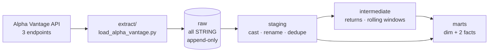

# Ticker Tape

An end-to-end ELT pipeline that pulls daily equity prices from the Alpha Vantage API into BigQuery, models them with dbt, and publishes a mart of moving averages, annualised volatility and trend signals.

**Stack:** Python · BigQuery · dbt 1.12 · dbt-utils
**Scale:** 7 models across 3 layers · 102 tests · ~23k source rows · $0/month

---

## What it produces

One row per ticker per trading session, carrying the metrics a desk actually looks at. Latest session:

| Company | Sector | Close | Ann. volatility | Uptrend |
|---|---|---:|---:|:---:|
| Amazon.com Inc | Consumer Cyclical | 256.26 | 54.0% | ✅ |
| Microsoft Corporation | Technology | 505.06 | 51.8% | ✅ |
| NVIDIA Corporation | Technology | 227.98 | 43.4% | ✅ |
| Alphabet Inc Class A | Communication Services | 340.65 | 40.1% | ❌ |
| Apple Inc. | Technology | 314.58 | 29.8% | ✅ |
| Exxon Mobil Corp | Energy | 156.44 | 24.1% | ✅ |
| Johnson & Johnson | Healthcare | 265.77 | 21.8% | ✅ |
| JPMorgan Chase & Co | Financial Services | 354.22 | 17.5% | ✅ |

In plain terms: it fetches prices for eight large-cap stocks every night, works out how each one is trending and how violently it has been moving, and runs ~100 automated checks before publishing. If the data is wrong, the pipeline stops rather than quietly shipping bad numbers.

---

## Architecture



| Layer | Materialisation | Models | Job |
|---|---|---|---|
| `raw` | table (loaded by Python) | 3 sources | Land API responses untouched |
| `staging` | view | 2 | Cast, rename, deduplicate. Nothing else. |
| `intermediate` | view | 2 | Returns, moving averages, volatility |
| `marts` | table / incremental | 3 | `dim_companies`, `fct_daily_prices`, `fct_ticker_performance_daily` |

**The dividing line between E/L and T.** The Python loader does *structural* work only — Alpha Vantage returns a date-keyed object rather than an array, which SQL cannot explode cleanly, so Python flattens it into rows. It also sanitises field names BigQuery would reject (`1. open` → `open`, `52WeekHigh` → `_52WeekHigh`). Everything else — casting, renaming, business logic — is dbt's. Every raw column lands as `STRING`.

**Raw is append-only.** Each run appends the full window it fetched, stamped with `_extracted_at`. Duplicates are expected; staging resolves them with `qualify row_number() over (partition by ticker, trade_date order by _extracted_at desc) = 1`. This keeps an audit trail of what the API said and when, which is what makes upstream restatements visible.

---

## Setup

### Prerequisites

- Python 3.12+
- A GCP project with the BigQuery API enabled
- A free [Alpha Vantage API key](https://www.alphavantage.co/support/#api-key)

### 1. Clone and install

```bash
git clone https://github.com/monil-p/Stock_Ticker_Analysis.git
cd Stock_Ticker_Analysis
py -m venv .venv
.\.venv\Scripts\Activate.ps1
pip install dbt-bigquery requests python-dotenv
```

### 2. BigQuery

Create a service account with **BigQuery Data Editor** + **BigQuery Job User**, download its JSON key, and store it **outside this repo**. Then create four datasets, all in the same location (`US`):

```
raw   analytics   analytics_ci   (analytics_staging / _intermediate / _marts are created by dbt)
```

### 3. Environment

Copy `.env.example` to `.env` and fill it in:

```
ALPHAVANTAGE_API_KEY=your_key_here
GCP_KEYFILE=C:/Users/you/.gcp/service-account.json
GCP_PROJECT_ID=your-project-id
BQ_RAW_DATASET=raw
BQ_LOCATION=US
```

> Use **forward slashes** in `GCP_KEYFILE`. dbt interpolates it into a double-quoted YAML string, where `\U` is an invalid escape and the profile fails to parse.

### 4. dbt profile

`~/.dbt/profiles.yml`:

```yaml
ticker_tape:
  target: dev
  outputs:
    dev:
      type: bigquery
      method: service-account
      keyfile: "{{ env_var('GCP_KEYFILE') }}"
      project: "{{ env_var('GCP_PROJECT_ID') }}"
      dataset: analytics
      location: US
      threads: 4
    ci:
      type: bigquery
      method: service-account
      keyfile: "{{ env_var('GCP_KEYFILE') }}"
      project: "{{ env_var('GCP_PROJECT_ID') }}"
      dataset: analytics_ci
      location: US
      threads: 8
```

> **dbt does not read `.env`.** `env_var()` reads the process environment. Load it first:
> ```powershell
> Get-Content .env | Where-Object { $_ -match '^\s*[^#\s].*=' } | ForEach-Object { $k,$v = $_ -split '=',2; Set-Item "env:$($k.Trim())" $v.Trim() }
> ```

### 5. Run

```bash
python extract/load_alpha_vantage.py --daily --overview
cd ticker_tape
dbt deps
dbt debug
dbt build
```

`--weekly` pulls full history and only needs running occasionally. `--all` runs all three (24 API calls). Add `--dry-run` to fetch and print without writing.

---

## Data model

### `fct_ticker_performance_daily` — the headline mart

| Column | Notes |
|---|---|
| `ticker`, `trade_date` | Grain. FK to `dim_companies`. |
| `open/high/low/close_price` | `NUMERIC`, unadjusted |
| `daily_return` | `FLOAT64`. A ratio is not money. |
| `close_ma_7/30/50_session` | NULL until the window is full |
| `volatility_30_session_annualized` | `stddev_samp(daily_return) * sqrt(252)` |
| `golden_cross_flag` | 30-session MA above 50-session MA |

**Windows count sessions, not days.** `rows between 29 preceding and current row` counts *rows*, and markets close at weekends — so a "30-session" average spans roughly six calendar weeks. The columns are named `_session` rather than `_30d` for that reason.

**`sqrt(252)`** annualises: volatility scales with the square root of time, and a year holds ~252 trading sessions.

**Incomplete windows are NULL, not partial.** A 30-session average computed from 5 sessions is a 5-session average wearing the wrong label. `session_index` guards each window until it is full, so those NULLs are load-bearing and the MA columns carry no `not_null` test.

**Volatility's guard is `session_index >= 31`, one higher than the MAs.** The earliest session has a NULL return and `stddev_samp` skips NULLs, so a 30-row frame anchored at session 30 would hold only 29 returns.

### Why one incremental model

`fct_daily_prices` is the only incremental model, and the reason is specific: the free daily endpoint returns a rolling window of just **100 sessions**, so raw can never hold more. Building this table incrementally is what lets history accumulate past the API's window. Everything else rebuilds in full — incrementality costs correctness guarantees, so it is worth paying for only where it buys something.

Its filter re-reads a **three-day tail** rather than strictly appending after `max(trade_date)`, and merges on `daily_price_key`. A strict cutoff would make an upstream restatement of an already-loaded session invisible forever.

> ⚠️ Once this table has accumulated sessions beyond the API's 100-session window, `--full-refresh` becomes **destructive** — it rebuilds from staging and discards the accumulated history that is the entire point of the model.

### Joins use the natural key

`fct_*.ticker → dim_companies.ticker`, no surrogate key. For a single source with stable, unique tickers that is sufficient and it keeps queries readable. The tradeoff: if `dim_companies` ever becomes a Type 2 snapshot, `ticker` stops being unique there and this join would fan out — a surrogate key per version would become necessary at that point, not before.

---

## Testing

102 tests in four tiers.

| Tier | Count | Examples |
|---|---:|---|
| Generic | 97 | `unique`, `not_null`, `relationships`, `accepted_values`, source freshness |
| dbt_utils | — | `unique_combination_of_columns` on every grain, `expression_is_true` for `high >= low` |
| Singular | 4 | See below |
| **Unit** | **1** | Tests logic, not data |

### Singular tests (`ticker_tape/tests/`)

- **`assert_marts_agree_on_close_price`** — the two fact marts reach `close_price` by different routes (one from staging, one via two intermediate models). Every single-model test can pass while the tables disagree with each other, because each is internally consistent. Only a cross-model test catches that drift.
- **`assert_no_future_trade_dates`** — catches timezone bugs in the extract, which otherwise produce entirely normal-looking rows.
- **`assert_volatility_present_after_warmup`** — the converse of the NULL assertions: past session 31, a value must actually be there. Without it, a broken window frame returning NULL everywhere would pass every other test.
- **`assert_no_unexpected_session_gaps`** — `severity: warn`, because it cannot distinguish a real market closure from a missing extract.

Severity is assigned deliberately rather than left to default. A test that cries wolf at 3am gets ignored, and then so do the others.

### The unit test

`test_daily_returns_logic` feeds three hand-built rows into `int_prices_daily_returns` and asserts the output. Unlike every other test here, it supplies its own input — it passes on an empty warehouse and fails when the SQL is wrong.

Three rows, each buying something:

1. **AAA, first session** — no prior close, so `prev_close_price` / `daily_return` / `days_since_prev_session` must be NULL. Exactly the behaviour the `not_null` tests deliberately don't cover.
2. **AAA, second session** — 100 → 125 is exactly 0.25. Chosen because 0.25 is exactly representable in binary floating point, so the assertion cannot fail on a rounding artifact. The dates are a real Friday→Monday, so the gap is 3.
3. **BBB, only session** — must return NULL, not borrow AAA's close.

Row 3 is the point. Removing `partition by ticker` from the `lag()` was verified to make it fail:

```
BBB, 2026-01-05, prev_close: NULL→125, daily_return: NULL→-0.6
```

A -60% return for a stock that never moved — plausible, fabricated, and invisible to every test that runs against real data.

---

## Known limitations

- **Prices are unadjusted.** `TIME_SERIES_DAILY_ADJUSTED` is a premium endpoint, so splits and dividends are not backed out. A return spanning a split shows an artificial jump.
- **100 daily sessions maximum per call.** `outputsize=full` became premium, so there is no deep daily backfill. The 50-session MA replaces the textbook 200; long-horizon trend belongs on the weekly source (1,399 weeks back to 1999, free).
- **25 API calls/day, ~1/second.** Drives the 8-ticker list and the split `--daily` / `--weekly` / `--overview` schedules. The loader self-throttles.
- **No orchestration yet.** Runs are manual. See below.
- **`dim_companies` is a snapshot, not history.** Sector and market cap reflect the latest extract only.

## Next steps

- [ ] **GitHub Actions** — a nightly `--daily` + `dbt build`, and a PR workflow building against the `ci` target
- [ ] **dbt snapshot on `dim_companies`** — SCD Type 2 for sector and market cap over time
- [ ] **Weekly staging + mart models** — 21,884 rows of weekly history are landed but not yet modelled
- [ ] **A dashboard** — Looker Studio connects to BigQuery natively
- [ ] **Custom generic test** — e.g. `assert_within_n_stdev` as a reusable outlier check

## What I'd do differently

**Model the weekly source first, not last.** I discovered `outputsize=full` was paywalled only after building around an assumed 20-year daily history. The weekly endpoint gives that for free, and finding it earlier would have shaped the marts differently.

**Use views for intermediate models from the start.** They began as `ephemeral`, which meant they couldn't be queried in the console while debugging, and unit tests had nowhere to materialise because an ephemeral model never creates its dataset. Two extra views is a cheap price for both.

**Run `dbt parse` before `dbt build`.** It catches syntax errors in seconds without touching the warehouse.

---

## Repo layout

```
├── extract/
│   └── load_alpha_vantage.py     # fetch → flatten → load, with self-throttling
├── ticker_tape/                  # dbt project
│   ├── models/
│   │   ├── staging/alpha_vantage/
│   │   ├── intermediate/
│   │   └── marts/
│   ├── tests/                    # 4 singular tests
│   ├── dbt_project.yml
│   └── packages.yml
├── .env.example
└── README.md
```

All dbt commands run from `ticker_tape/`, or pass `--project-dir ticker_tape` from the repo root.
